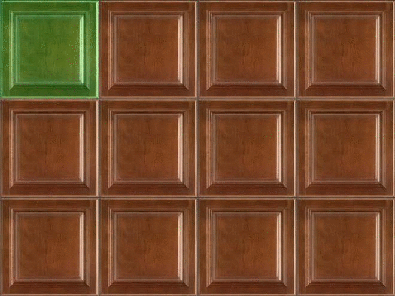
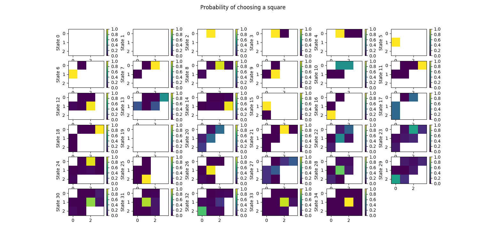
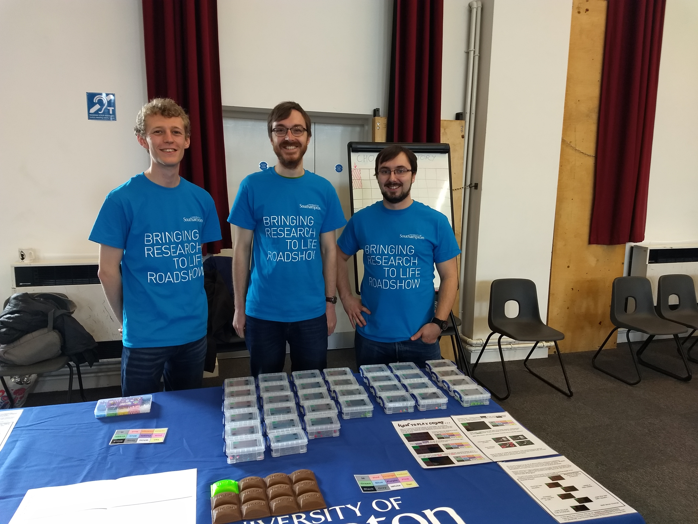
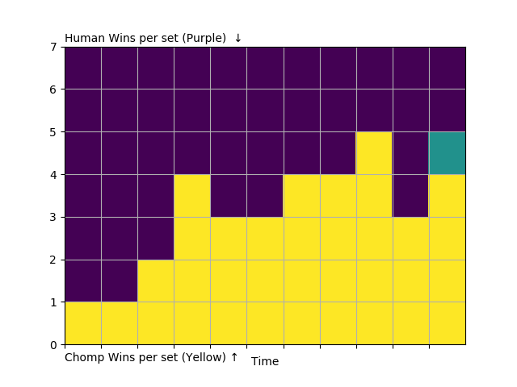

# chomp

[Chomp](http://www.papg.com/show?3AEA) is a pencil-and-paper territorial game for two players, conventionally played on a 3x4 grid representing a delicious chocolate bar. Players take it in turns to bite off rectangular regions from the lower right corner, aiming for the other player to eat the last, poisoned square.

With 3 rows and 4 columns, the game has a total of 34 states, which makes it a candidate for a simple machine-learning demonstration, in the same vein as the [MENACE](https://github.com/mscroggs/MENACE) machine.

The 50GamesHuman.pkl file contains the state of the machine after 50 games against a human, starting with 2 beads in each box. The 2000Games#.pkl files contain the machine state after facing a random opponent, or another 'intelligent' opponent using the same strategy. perfect.pkl is almost certain to win when playing first.

This image shows the relative probability of choosing a square on a colour scale, after 10000 games of self-play. White squares cannot be played (they are already eaten, or they are the poisoned top-left square). State 34 (lower right corner of the image) is the starting state of the game. The program has determined that playing in square number 6 (3rd column, 2nd row) is the best first move.

The physical version of Chomp, which uses plastic containers filled with coloured beads to represent game states, was premiered at a [Bringing Research to Life](https://www.southampton.ac.uk/per/university/roadshow.page)  roadshow event at a school in south-west england.

Including a short training period for three demonstrators to learn how to host the game, 76 games were played, in sets of seven. The results were marked on the chart below, with human wins marked from the top of the diagram and chomp wins from the bottom. The plot shows Chomp wins more games over time.  

